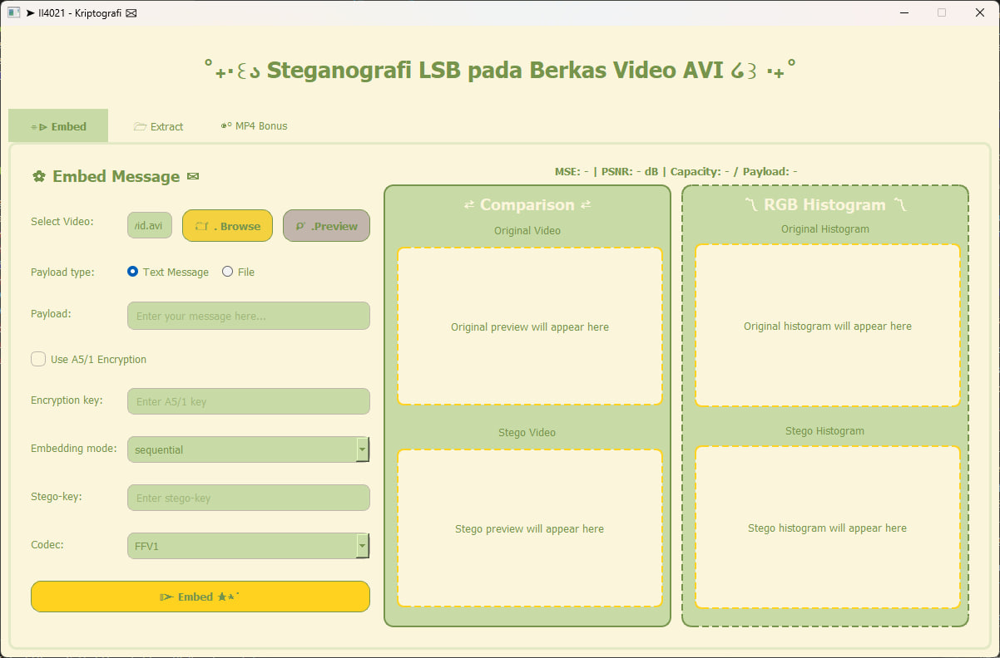
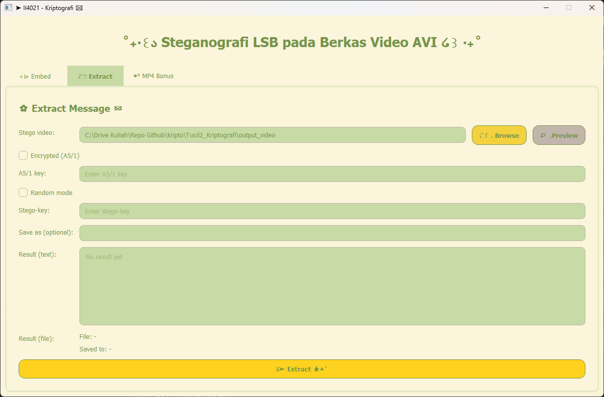
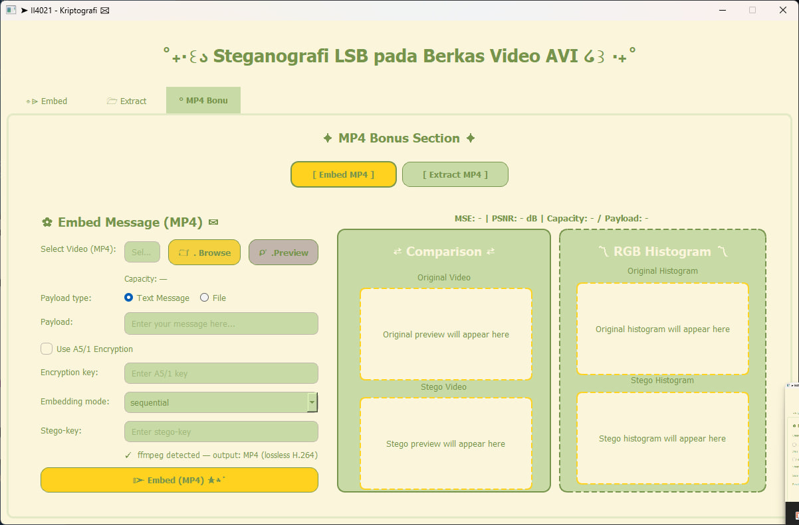

# README - Steganografi LSB pada Video AVI/MP4

## i. Nama dan Deskripsi Program

**Nama Program:**
**Aplikasi Steganografi Video berbasis LSB dengan Enkripsi A5/1**

**Deskripsi Program:**
Program ini merupakan aplikasi berbasis Graphical User Interface (GUI) untuk menyisipkan (embedding) dan mengekstraksi (extracting) pesan rahasia pada file video menggunakan metode **Least Significant Bit (LSB)**.

Sistem mendukung payload berupa teks maupun file, dengan pilihan mode penyisipan:

- **Sequential**
- **Random** (menggunakan stego-key)

Sebagai lapisan keamanan tambahan, payload dapat dienkripsi menggunakan algoritma **A5/1**.

Program juga menghitung kapasitas penyisipan secara otomatis, menyimpan metadata payload pada header, serta mendukung alur kerja video **AVI** dan **MP4**. Untuk menjaga data LSB tetap utuh, proses output menggunakan jalur lossless (MP4 lossless via FFmpeg jika tersedia, atau fallback AVI lossless).

---

## ii. Teknologi yang Digunakan (Tech Stack)

- **Python 3** - bahasa pemrograman utama
- **PyQt5** - framework GUI desktop
- **OpenCV (cv2)** - membaca, memproses, dan menulis frame video
- **NumPy** - operasi array dan perhitungan metrik (MSE/PSNR, histogram)
- **FFmpeg (opsional, direkomendasikan)** - encoding MP4 lossless

---

## iii. Dependensi

Install dependensi Python:

```bash
pip install opencv-python numpy PyQt5
```

Install dependensi FFmpeg:

1. Download FFmpeg dari:
	https://www.gyan.dev/ffmpeg/builds/
2. Ekstrak lalu tambahkan folder `bin` FFmpeg ke Environment Variable **PATH**
3. Verifikasi di terminal:

```bash
ffmpeg -version
```

---

## iv. Tata Cara Menjalankan Program

### 1. Clone Repository

```bash
git clone <link-repository>
cd <nama-folder-project>
```

### 2. Struktur Direktori Program

```text
project/
├── doc/
├── img/
├── src/
│   ├── insertion.py
│   ├── extraction.py
│   ├── encrypt.py
│   └── mp4_steganography.py     
├── video/
│   ├── contoh_vid.avi
│   └── contoh_vid.mp4   
├── output/
├── output_video/
├── output_pesan/│
├── gui_mp4_tab.py
├── gui.py
└── main.py
```

Catatan:

- Folder `output`, `output_video` dan `output_pesan` akan dibuat otomatis jika belum tersedia.

### 3. Menjalankan Program

Mode GUI (utama):

```bash
python gui.py
```

## v. Preview GUI Sistem





Catatan:

---

## Cara Menggunakan Program

### Embedding (Menyisipkan Pesan)

1. Pilih video cover (AVI/MP4).
2. Pilih jenis payload:
	- Teks
	- File
3. Pilih mode penyisipan:
	- Sequential
	- Random (butuh stego-key)
4. Aktifkan enkripsi A5/1 (opsional) dan isi key jika dipakai.
5. Jalankan proses embed.

Hasil stego video disimpan ke folder `output_video`.

### Extraction (Mengambil Pesan)

1. Pilih file stego video.
2. Masukkan stego-key jika mode random.
3. Masukkan key enkripsi jika payload terenkripsi A5/1.
4. Jalankan proses extract.

Hasil payload disimpan ke folder `output_pesan`.

---

## Fitur Utama Program

- Steganografi LSB pada kanal warna video
- Mode penyisipan **Sequential** dan **Random**
- Enkripsi payload menggunakan **A5/1**
- Perhitungan kapasitas payload otomatis
- Validasi payload terhadap kapasitas video
- Perhitungan kualitas stego-video:
  - **MSE**
  - **PSNR**
- Perbandingan histogram RGB (GUI)
- Dukungan GUI interaktif berbasis **PyQt5**
- Dukungan AVI dan alur MP4 lossless (dengan fallback aman)

---

## Kontributor

| No | Nama | NIM |
| --- | --- | --- |
| 1 | Khairunisa Azizah | 18223117 |
| 2 | Leonard Arif Sutiono | 18223120 |
| 3 | Nakeisha Valya Shakila | 18223133 |